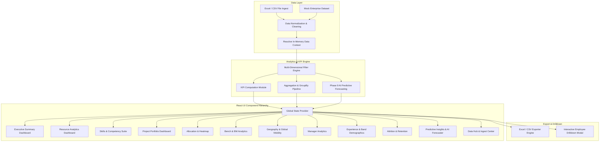

# ERMA System Architecture & Data Flow

## Technical Architecture Details
1. **State Management**: Built on React Context API with optimized useMemo selectors to maintain sub-millisecond filtering across 100+ multi-dimensional records.
2. **Component Architecture**: Modular page designs adhering to Single Responsibility Principle, with shared Layout (Sidebar, Header, FilterBar) and reusable DataTable and Card primitives.
3. **Data Security & Privacy**: Client-side in-memory analytics ensuring no corporate roster data leaves the user session.
